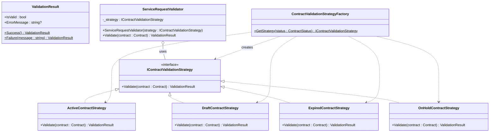
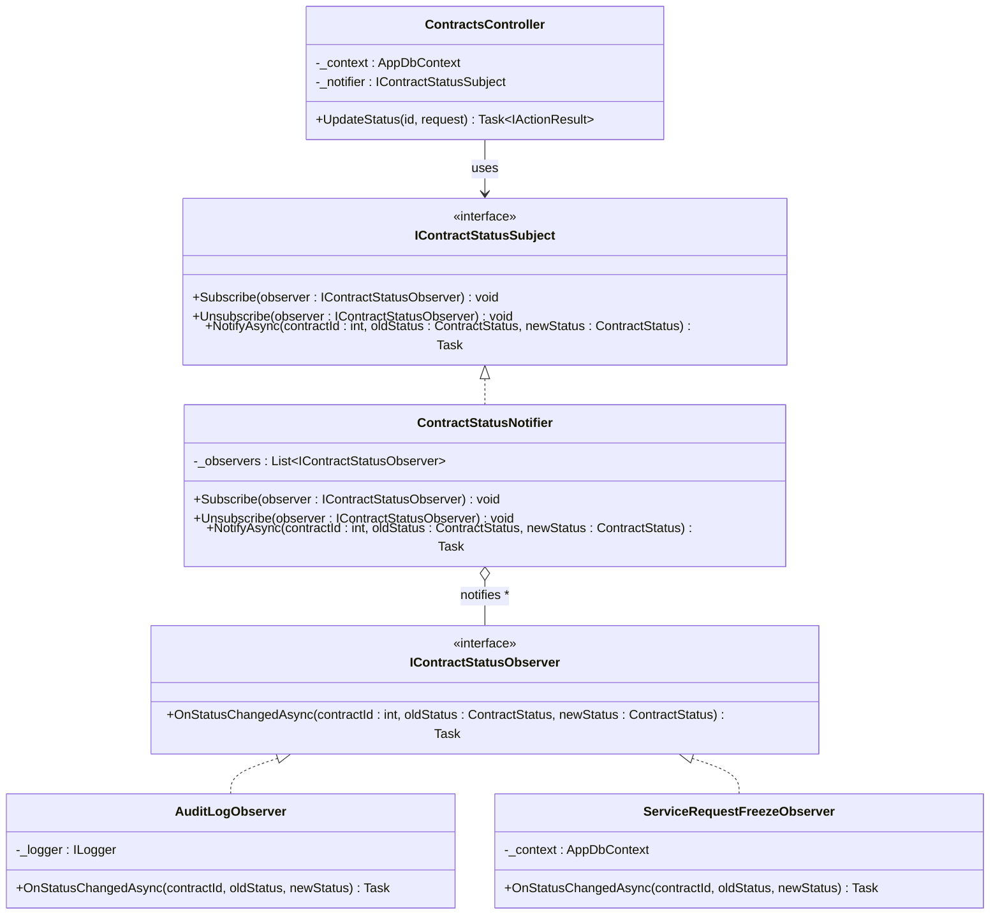
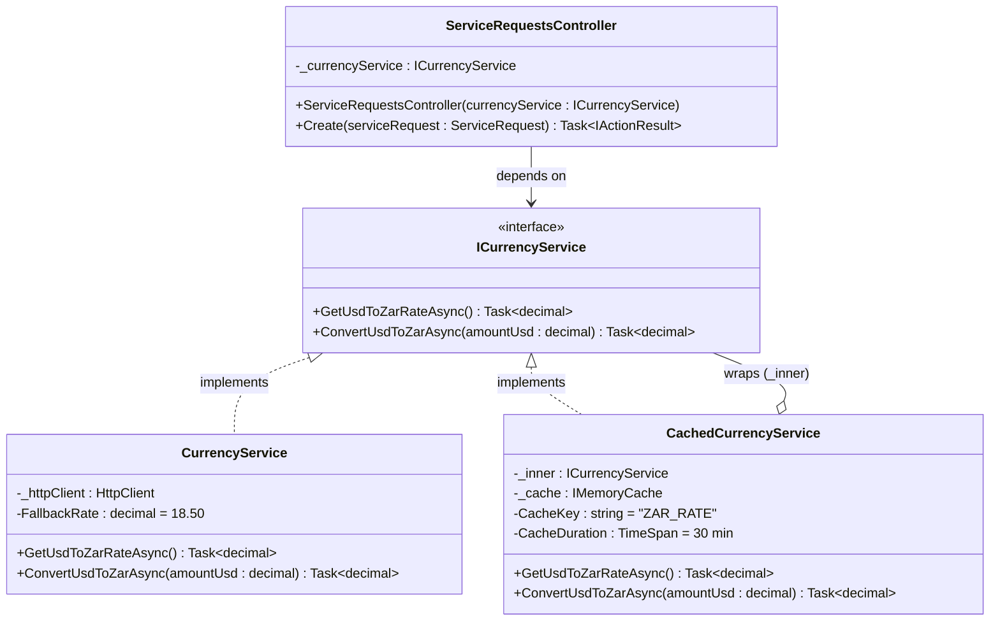

# GLMS — GoF Design Pattern Selection

## Patterns Chosen

| # | Pattern | Category | Applied To |
|---|---------|----------|------------|
| 1 | **Strategy** | Behavioural | Contract validation rules when creating a ServiceRequest |
| 2 | **Observer** | Behavioural | Notifying subscribers when a Contract's status changes |
| 3 | **Decorator** | Structural | Adding caching to the currency exchange service |

---

## Pattern 1 — Strategy

### Intent
Define a family of algorithms (validation rules), encapsulate each one, and make them interchangeable. The `ServiceRequestsController` selects the correct validation strategy at runtime based on the parent Contract's status, instead of a chain of `if/else` statements.

### UML Class Diagram



### How It Maps to C# Code

```csharp
// Interface
public interface IContractValidationStrategy
{
    ValidationResult Validate(Contract contract);
}

// Concrete strategies
public class ActiveContractStrategy   : IContractValidationStrategy { ... } // returns Success
public class DraftContractStrategy    : IContractValidationStrategy { ... } // returns Success
public class ExpiredContractStrategy  : IContractValidationStrategy { ... } // returns Failure("Expired")
public class OnHoldContractStrategy   : IContractValidationStrategy { ... } // returns Failure("OnHold")

// Factory selects strategy
public static class ContractValidationStrategyFactory
{
    public static IContractValidationStrategy GetStrategy(ContractStatus status) => status switch
    {
        ContractStatus.Active  => new ActiveContractStrategy(),
        ContractStatus.Draft   => new DraftContractStrategy(),
        ContractStatus.Expired => new ExpiredContractStrategy(),
        ContractStatus.OnHold  => new OnHoldContractStrategy(),
        _                      => throw new ArgumentOutOfRangeException()
    };
}

// Usage in API controller — replaces if/else chain
var strategy  = ContractValidationStrategyFactory.GetStrategy(contract.Status);
var validator = new ServiceRequestValidator(strategy);
var result    = validator.Validate(contract);
if (!result.IsValid) return BadRequest(result.ErrorMessage);
```

---

## Pattern 2 — Observer

### Intent
Define a one-to-many dependency so that when a Contract's status changes, all registered observers are notified automatically. This decouples status-change side-effects (audit logging, cascading cancellations) from the contract update logic in the API controller.

### UML Class Diagram



### How It Maps to C# Code

```csharp
// Subject interface
public interface IContractStatusSubject
{
    void Subscribe(IContractStatusObserver observer);
    Task NotifyAsync(int contractId, ContractStatus oldStatus, ContractStatus newStatus);
}

// Concrete subject
public class ContractStatusNotifier : IContractStatusSubject
{
    private readonly List<IContractStatusObserver> _observers = new();
    public void Subscribe(IContractStatusObserver o) => _observers.Add(o);
    public async Task NotifyAsync(int id, ContractStatus old, ContractStatus @new)
    {
        foreach (var o in _observers)
            await o.OnStatusChangedAsync(id, old, @new);
    }
}

// Observers
public class AuditLogObserver : IContractStatusObserver
{
    public Task OnStatusChangedAsync(int id, ContractStatus old, ContractStatus @new)
    {
        // write to audit log
    }
}

public class ServiceRequestFreezeObserver : IContractStatusObserver
{
    // When contract goes OnHold, cancel all Pending service requests
}

// Usage in PATCH /api/contracts/{id}/status
var old = contract.Status;
contract.Status = request.Status;
await _context.SaveChangesAsync();
await _notifier.NotifyAsync(id, old, request.Status);
```

---

## Pattern 3 — Decorator

### Intent
Attach additional responsibilities (response caching) to `CurrencyService` dynamically without modifying it. `CachedCurrencyService` wraps the real service and returns a cached ZAR rate for a configurable TTL, eliminating redundant HTTP calls on every page load.

### UML Class Diagram



### How It Maps to C# Code

```csharp
// Component interface (new — both classes implement this)
public interface ICurrencyService
{
    Task<decimal> GetUsdToZarRateAsync();
    Task<decimal> ConvertUsdToZarAsync(decimal amountUsd);
}

// Existing concrete component (implement the interface, no logic change)
public class CurrencyService : ICurrencyService { ... }

// Decorator
public class CachedCurrencyService : ICurrencyService
{
    private readonly ICurrencyService _inner;
    private readonly IMemoryCache _cache;
    private const string CacheKey = "ZAR_RATE";

    public CachedCurrencyService(ICurrencyService inner, IMemoryCache cache)
    {
        _inner = inner;
        _cache = cache;
    }

    public async Task<decimal> GetUsdToZarRateAsync()
    {
        if (_cache.TryGetValue(CacheKey, out decimal cached))
            return cached;

        var rate = await _inner.GetUsdToZarRateAsync();
        _cache.Set(CacheKey, rate, TimeSpan.FromMinutes(30));
        return rate;
    }

    public async Task<decimal> ConvertUsdToZarAsync(decimal amountUsd)
    {
        var rate = await GetUsdToZarRateAsync();
        return Math.Round(amountUsd * rate, 2);
    }
}

// Program.cs — wire the decorator
builder.Services.AddMemoryCache();
builder.Services.AddHttpClient<CurrencyService>();
builder.Services.AddScoped<ICurrencyService>(sp =>
    new CachedCurrencyService(
        sp.GetRequiredService<CurrencyService>(),
        sp.GetRequiredService<IMemoryCache>()));
```

---

## Summary

| Pattern | Where It Lives | Benefit |
|---------|---------------|---------|
| **Strategy** | `GLMS.Api/Validation/` | Replaces brittle `if/else` chains; adding a new status means adding one class |
| **Observer** | `GLMS.Api/Events/` | Status-change side-effects are decoupled; each concern is independently testable |
| **Decorator** | `GLMS.Api/Services/` | Live exchange rate is cached for 30 min; zero changes needed to `CurrencyService` itself |
